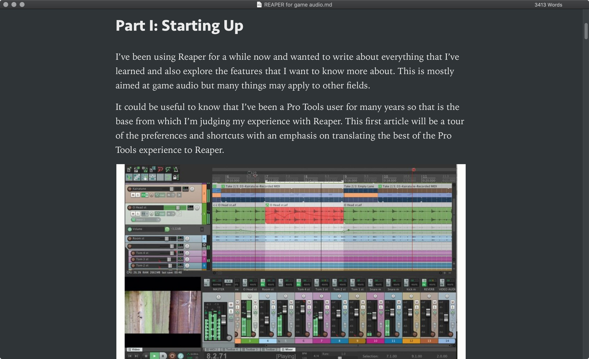

# Typora - Custom user CSS

My custom CSS for Typora, as explained in [Typora's Help Pages](https://support.typora.io/Add-Custom-CSS/).

Featuring the same typography used of other interfaces I've been using:

- Seravek for headings and UI elements
- Iowan Old Style for body copy

The user CSS is currently based on the themes:

- Notion Light Enhanced
- Notion Dark Enhanced

## Example

